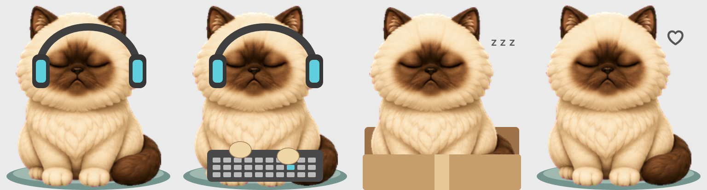

# Bagad Billa 🐾

A fluffy, slightly grumpy macOS desktop cat that looks at your cursor, types alongside you, wears headphones, plays, naps, and reminds you to walk.

**Author: GOPAL GOYAL**  
**Co-author: SAKSHAM BATTA**



## Requirements

- macOS 13 or later. Developed and tested on Apple Silicon; the build script targets the current Mac's architecture. Intel builds have not been tested.
- Apple Xcode Command Line Tools (`xcode-select --install`).
- No third-party packages, API keys, accounts, or network services are needed at runtime.

## Build and run

```bash
git clone https://github.com/gopalgoyal2002/bagad-billa.git
cd bagad-billa
./scripts/build.sh
./scripts/run.sh
```

You can also double-click `build/Bagad Billi.app` in Finder. The app appears as a floating cat with a paw icon in the menu bar, without a Dock icon. Keep the full app bundle together. Quit an existing copy before rebuilding or running a copy from another location.

The script compiles Swift against AppKit, ApplicationServices, and CoreAudio, packages all sprite frames, and applies a local ad-hoc signature. This is not a notarized distribution. Building on your own Mac is the supported setup; downloaded binaries may require macOS approval.

To rebuild after changes, quit the cat, run `./scripts/build.sh`, then `./scripts/run.sh`. macOS may require renewing Accessibility permission after a rebuild or moving the app.

## Enable typing detection

1. Right-click the cat and leave **Typing reactions** checked.
2. Choose **Open keyboard permission settings…**.
3. In System Settings → Privacy & Security → Accessibility, add the exact `build/Bagad Billi.app` you launched and enable it.
4. Type in a normal text editor. The menu's typing status indicates whether permission is missing, it is waiting for keys, or it has received keys.

Permission is checked every second. Relaunch if macOS requests it. If the switch is on but the menu still says permission is needed, remove the old Accessibility entry with **−**, add the current app with **+**, and enable it. A prior build's authorization may no longer match.

**Preview typing** tests the animation without keyboard permission. Secure-input/password fields may suppress keyboard events. “Receiving keys” means this session has received keyboard activity, not necessarily that keys are being pressed at that instant.

## Features and controls

Right-click the cat or click the menu-bar paw to access all controls.

- **Cursor tracking:** sixteen gaze directions, with a neutral blink when the cursor is close to its face. Pause/resume tracking from the menu.
- **Typing:** alternating paws and a little keyboard; faster typing produces faster taps and “Turbo paws”. Returns to normal after 0.7 seconds without detected keys. Typing interrupts temporary petting/stretch animations and appears during focus; a short active chase/pounce finishes first.
- **Click and drag:** click to wave, double-click to jump, drag to reposition. Position is saved. Small/Large changes size; Reset position brings the cat to the visible screen.
- **Petting:** rub the pointer across its head for closed eyes and a heart. Pet Bagad Billa triggers it manually.
- **Treats:** Give a fish treat, then click the fish for a short pounce and return. Unused fish disappear after 20 seconds.
- **Sleep:** automatic nap after 3 minutes without mouse movement or detected typing; movement/typing wakes it. Nap now is available. Music mode prevents automatic idle naps.
- **Cursor play:** occasional short chases when the moving cursor is nearby, with at least 75 seconds between automatic attempts. Disable Occasional cursor play or trigger Play with cursor manually.
- **Walking reminders:** enabled by default, every 20 minutes while running. “Stand up & take a short walk” displays for 30 seconds, including during focus and pet naps. Preview walk reminder triggers it immediately. Toggle reminders in the menu.
- **Stretch reminders:** every 30 minutes while awake, with a brief paw-up animation. Focus and sleep defer these reminders. Stretch now is available.
- **Focus:** start 25-minute or 5-minute sessions, or try a 10-second preview. The cat naps, shows a countdown, and jumps when done. Cancel from the menu.
- **Homes:** choose a cushion, cardboard box, or no home. The cat settles lower in its box during sleep/petting.
- **Headphones:** automatic mode checks whether the default audio output device is active. It cannot distinguish music from notifications, silent streams, or apps keeping audio open. Manual music mode works with any player. Head bobbing is decorative, not synchronized to beats; headphones also work during typing.
- **Sounds:** optional synthesized purr and completion/reminder chime. Sounds and purring is off by default.

## Timing, preferences, and limitations

The companion must be running for reminders. There are no scheduled background jobs or automatic login startup items. Restarting begins fresh countdowns; missed walk reminders do not queue up. Re-enabling walk reminders starts a fresh 20 minutes. Focus timing uses system uptime and is not intended as an alarm while the Mac is asleep.

Position, typing toggle, automatic nap/play/reminder toggles, sound preference, home, and automatic audio mode use macOS UserDefaults. Size, manual headphones, cursor pause, and active focus timers are session-only.

If the cat is hidden, use **paw menu → Reset position**. If you see two cats, quit the other standalone copy or hide the separate Codex pet. This app currently has no single-instance enforcement across different bundle copies.

## Privacy

The keyboard handlers observe event timing only: they do not read characters/key codes, record typed text, or send it anywhere. Turning typing reactions off removes the keyboard monitors. Cursor tracking reads pointer coordinates. Audio detection reads device-running state; it does not use the microphone or record audio. Preferences stay on the Mac. Runtime code does not make network requests.

## Tests and visual preview

```bash
./scripts/test.sh
"build/Bagad Billi.app/Contents/MacOS/BagadBilli" --render-gallery "$PWD/build/features-preview.png"
```

Tests cover sixteen directions, compass/deadzone cases, typing expiry and cadence/storage, sleep/wake, focus completion, reminder timing and disabled behavior, excursion return, and sprite availability. Gallery rendering requires a logged-in macOS GUI session. Real cross-app typing requires user-granted Accessibility permission; deterministic tests do not prove that system permission is granted.

Optional startup diagnostics (no typed text):

```bash
# Quit the running cat first.
open "build/Bagad Billi.app" --args --diagnostics "$PWD/build/typing-diagnostics.txt"
```

This records permission, enabled state, and monitor installation at startup; it is not a live-updating report.

## Source layout

- `Sources/main.swift`: native AppKit window, rendering, input monitoring, behavior state, audio-state detection, and self-tests.
- `Resources/frames/`: all animation and directional PNG frames.
- `Resources/Info.plist`: application metadata.
- `scripts/`: reproducible build, run, and test commands.
- `docs/features-preview.png`: rendered feature examples.
- `codex-pet/`: original v2 Codex pet manifest and sprite atlas, separate from the standalone application.

The Codex sprite package does not implement this app's global cursor/keyboard interactions or timers. The standalone Swift app supplies those behaviors. Build products, local diagnostics, temporary generation files, and caches are excluded from version control.

See [AUTHORS.md](AUTHORS.md) for credits.

## Contribution and approval policy

All changes to `main` require a pull request, code-owner approval, passing macOS checks, and resolved review conversations. Direct pushes, force pushes, and branch deletion are blocked by repository protection, including for administrators. See [CONTRIBUTING.md](CONTRIBUTING.md) and [SECURITY.md](SECURITY.md).

This repository is publicly readable; public visibility permits viewing and forking, not editing this repository. Its owner can manage access and change protection settings. No open-source license has been selected for this project.

Headphone fit uses per-direction ear anchors and the same drawing transform as the cat, including breathing and box settling. Profile views hide the far ear cup. Headphones temporarily hide during action sprites without fitted anchors and return for idle, gaze, and typing poses.

## Terminal notifications (zsh)

Source the integration from your `~/.zshrc`, using the absolute path to this checkout:

```zsh
source /absolute/path/to/bagad-billa/integrations/bagad-billa.zsh
```

Open a new terminal tab, or run that source command in an existing zsh tab. This works in IDE terminals that start interactive zsh and load that configuration, as well as standalone terminals. Bash, fish, remote hosts, containers, and IDE task runners that do not load this shell configuration are not automatically covered.

Failures are reported when the shell returns to its prompt. Successful commands are reported if they ran for at least three seconds. For explicit input/approval requests, run `bagad-help` before the waiting operation. Arbitrary prompts are not inferred from terminal output. A foreground command still running cannot automatically report its own need for input unless it explicitly integrates this signal.

The cat displays an alert for 12 seconds and retains the latest 12 alerts under Recent terminal activity. Terminal notifications can be disabled in its menu. Alerts identify the terminal device (for example ttys001); exact IDE-tab activation is not implemented.

Only event kind, numeric exit code, elapsed seconds, timestamp, terminal device label, and coarse terminal application category are written locally. No command text, arguments, working directory, terminal output, or credentials are captured. Events use private files under `~/Library/Application Support/BagadBilli/events`, overwritten per shell process. The companion reads bounded files once per second and ignores stale events. Very rapid events from the same shell can be coalesced. This is a local convenience notification channel, not a security audit log; another process running as your user can write to it.

Try `sleep 3`, then `false`, then `bagad-help`. To uninstall, remove the source line from `.zshrc` and start fresh terminal tabs. Existing tabs retain their hooks until closed. The integration does not execute commands on your behalf.

## Running agent list

A panel above the cat lists recognized coding-agent executable processes owned by your macOS user, refreshing every five seconds. Supported executable names: codex, claude, aider, gemini, opencode, goose. Each row shows a process ID so multiple instances remain distinguishable. Toggle Show running agents above cat in the menu. The panel follows the cat and stays within the screen.

“Running” means the process exists, not that an agent is actively reasoning. IDE extensions, subprocess agents inside another process, remote agents, and CLI tools whose executable appears only as node/python are not discoverable with this method. No command arguments or conversation text are inspected. This is a supported-process list, not a complete inventory of every agent in every application.

The Agent Desk displays up to three process cards per page. Click the header to collapse/expand; click the left/right half of the footer to change pages. Failure/help terminal events expand the desk and highlight its latest-alert footer. Terminal alerts are not attributed to individual agents without a verified mapping. Cards explicitly show activity unknown; task descriptions, true busy/idle state, elapsed task time, and exact terminal navigation are not available from process discovery.

## Claude Code live control (opt-in terminal launcher)

Run this from an interactive terminal in the project you want Claude to work in:

```bash
/absolute/path/to/bagad-billa/integrations/claude/bagad-claude
```

It requires the existing Claude Code CLI, its normal login, and `/usr/bin/python3`. Extra CLI arguments are forwarded, for example `bagad-claude --resume` to use Claude's session picker. Exit the old session before resuming it; this launcher cannot attach to a terminal already running outside it.

A **Live Claude** card appears above the pet. Click it to open a window with recent terminal output, an input field, **Send**, and **Interrupt (Esc)**. Send forwards your input through bracketed paste and Enter. Interrupt sends Escape, Claude's interactive cancel key; it is not a force-kill and its effect depends on Claude's current UI state. Answer permission prompts deliberately using the connected terminal or the input box; the integration does not automatically approve tools. Multi-choice interfaces requiring arrow keys remain available in the original terminal.

Your original terminal stays interactive. The launcher owns only that Claude pseudo-terminal; it does not type into other terminals. Start additional launcher instances for separate project cards. Closing the control window leaves the terminal session running. Exiting the Claude process or closing its launcher removes the connection. No agent is started simply by launching the pet.

**Live-output privacy:** unlike the metadata-only zsh integration, this explicitly connected mode reads Claude's terminal output and stores a rolling snapshot (up to 8,000 sanitized characters) in private local files under `~/Library/Application Support/BagadBilli/claude`. Output may contain project content or secrets Claude prints. Snapshots are deleted on normal shutdown; a crash can leave a stale snapshot, which the pet ignores after five seconds. User messages travel through a private local socket to Claude and may then be sent to Claude's service under its normal settings. The launcher does not add telemetry or bypass Claude permission checks. It displays recent output, not hidden reasoning or a structured understanding of task status.

Control is scoped to launcher-created sessions. Ordinary detected processes remain view-only. Input fields target the selected connection, identified by project and PID. The app does not provide automatic takeover of existing sessions.

Bridge test (fake Claude executable, no model/API request):

```bash
PYTHONDONTWRITEBYTECODE=1 /usr/bin/python3 tests/test_claude_bridge.py
```

The test requires a macOS environment allowing pseudo-terminals and local sockets. It covers output transport, sending input, Escape, invalid controls, and cleanup. Live authenticated Claude behavior still depends on the installed CLI and terminal prompt state.
